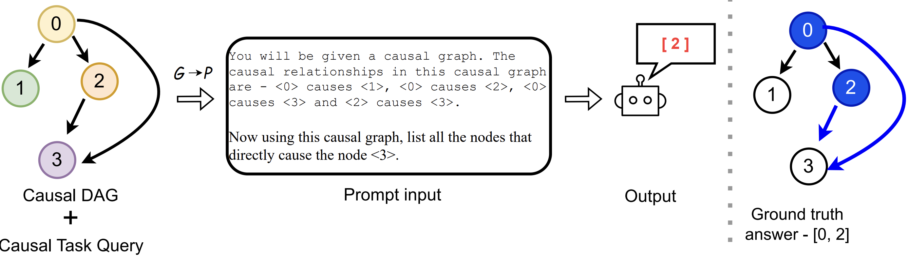

# CausalGraph2LLM: Evaluating LLMs for Causal Queries
Codebase to systematically evaluate the causal graph understanding in LLMs.

[Ivaxi Sheth](https://ivaxi0s.github.io/), [Bahare Fatemi](https://baharefatemi.github.io/homepage/), [Mario Fritz](https://cispa.saarland/group/fritz/)


## Abstract
Causality is essential in scientific research, enabling researchers to interpret true relationships between variables. These causal relationships are often represented by causal graphs, which are directed acyclic graphs. With the recent advancements in Large Language Models (LLMs), there is an increasing interest in exploring their capabilities in causal reasoning and their potential use to hypothesize causal graphs. These tasks necessitate the LLMs to encode the causal graph effectively for subsequent downstream tasks. In this paper, we propose the first comprehensive benchmark, \emph{CausalGraph2LLM}, encompassing a variety of causal graph settings to assess the causal graph understanding capability of LLMs. We categorize the causal queries into two types: graph-level and node-level queries. We benchmark both open-sourced and closed models for our study. Our findings reveal that while LLMs show promise in this domain, they are highly sensitive to the encoding used. capable models like GPT-4 and Gemini-1.5 exhibit sensitivity to encoding, with deviations of about 60%. We further demonstrate this sensitivity for downstream causal intervention tasks. Moreover, we observe that LLMs can often display biases when presented with contextual information about a causal graph, potentially stemming from their parametric memory.

<p align="center">
  
</p>

> CausalGraph2LLM benchmark that uses causal queries to evaluate the sensitivity and the causal understanding of LLM for graph-level and node-level queries.

## Organisation

The CausalGraph2LLM benchmark is organized to thoroughly assess the ability of Large Language Models (LLMs) to understand and process causal graphs. The benchmark is evaluated over many different axes. 

1. Different encoding structures - Given the sensitivity of LLMs to encoding strategies, we explore various methods to encode causal graphs into text. The effectiveness of different encoding approaches is benchmarked to determine the most robust and accurate methods for causal reasoning tasks.

  <details>
  <summary>List of Encoding Strategies</summary>

    - **JSON:** This encoding represents the causal graph in a JSON format, capturing nodes and their causal relationships in a hierarchical structure.
    - **Adjacency:** This encoding lists all edges in the graph, showing direct causal relationships between nodes.
    - **Adjacency Matrix:** Represents the graph as a matrix where each cell indicates the presence (1) or absence (0) of a direct causal relationship between nodes.
    - **GraphML:** Uses the GraphML format to describe the graph, which is a comprehensive and widely-used XML-based format for graph representation in code.
    - **Graphviz:** Uses the DOT language to describe the graph, which can be visualized using Graphviz tools.
    - **Single Node:** Lists each node with the nodes it directly causes, formatted in a straightforward textual description.
    - **Multi Node:** Provides a multi-node description where each cause is followed by all its effects, formatted as a continuous description.

  </details>

2. Graph-level Queries and Node-level Queries - Graph-level queries focus on the overall structure and properties of the causal graph. These tasks require the LLMs to interpret and respond to queries that involve understanding the relationships and dependencies between multiple nodes within the entire graph. Node-level queries focus on individual nodes and their immediate relationships within the causal graph. These tasks require the LLMs to handle detailed and specific queries about single nodes and their direct connections.

3. Tasks - Finally for both graph-level and node-level queries, we design a diverse set of tasks inspired by potential real-world applications and downstream tasks.

  <details>
  <summary>List of Tasks</summary>

    - **Child Identification:** Determining the child nodes for a given parent node, indicating direct causal effects.
    - **Parent Identification:** Identifying the parent nodes for a given child node, showing direct causal influences.
    - **Source Identification:** Finding nodes with no incoming edges, representing variables that are not caused by any other variable.
    - **Sink Identification:** Identifying nodes with no outgoing edges, representing variables that do not cause any other variable.
    - **Mediator Identification:** Recognizing mediator nodes that lie on the path between two other nodes, representing variables that mediate causal effects.
    - **Confounder Identification:** Identifying confounder nodes with outgoing edges to two or more other nodes, representing variables that can induce spurious associations between their child variables if not properly controlled.

  </details>

4. Presence/Absence of Contextual information -  Our benchmark includes an analysis of biases introduced by the LLMs' training data.

5. We further evaluate LLM sensitivity on downstream intervenetional analysis.

## Running code

### Dependecies
The code was developed with Python 3.10.6. To set up the repository, follow the below steps:

```
git clone https://github.com/ivaxi0s/CausalGraph2LLM.git
python -m venv causalg2llm
source causalg2llm/bin/activate
pip install -r requirements.txt
```

### Generating synthetic causal DAGs
Synthetic causal DAGs are used to:
- Create controlled environments to benchmark LLM performance on causal reasoning tasks.
- Test the models' ability to handle different graph structures, sizes, and complexities.

To generate a synthetic graph, one must mention the number of nodes and edges desired in the graph. 

```
python src/data/generate_random_graphs.py --num_nodes 5 --num_edges 5
```


### BNLearn causal DAGs
In addition to synthetic graphs, we include standard causal graphs from literature to study:
- The models' capabilities against established causal relationships.
- The biasing in results that occurs due to model pretraining

The dataset is downloaded when `main.py` is run. The nodes can be representated in two ways - numerical and commonsense(with contextual information). The codebooks are present in the `codebook/` folder. 

### Arguments 
- The *task* can be changed using `--node_type` argument. 
- The *prompting style/embedding style* can be changed using `--emb` argument. 
- The *model* can be changed using `--model` argument. 
- The *dataset* can be change using `--dataset` argument.  
- The *query_type* can be divided into two, `binary` and `desc` for node-level and graph-level queries respectively.

- For synthetic datasets, you need to include the `--syn` argument. 
- For graph level tasks, you need to include the `--query_type desc` argument. 
- For BNLearn graph, you can include either `--commonsense` argument if you contextual variables are needed or `--numerical` for randomised variable names. 
- For the downstream interventional task, use the argument `--interv`


### Basic Graph Queries
To evaluate the baseline causal graph understanding task, we prompt the LLMs with causal query tasks resembling those encountered in larger causal reasoning tasks. We run this experiment on synthetic DAGs. There are six tasks that we evaluate the performance against. We also test for each encoding style. 

An example to run basic graph-level query for source task is as follows:

```
python main.py --model gpt-4 --emb json --dataset syn_20_20 --syn --prompt --node_type source --query_type desc

```

### Effect of pretraining knowledge on causal graph understanding
We aim to evaluate the effect of pretraining knowledge on the understanding of causal graphs. Current research often utilizes LLMs to obtain causal priors by leveraging the semantic information embedded in variable names. we specifically test causal graphs with and without contextual knowledge, allowing us to directly assess how pretraining influences LLMs’ performance. 

We run experiments on Alarm and Insurance DAGs with and without variable meta data for this. 

An example to run experiment on Alarm with contextual knnowledge is as follows:

```
python main.py --model gpt-4 --emb json --dataset alarm --commonsense --prompt --node_type source --query_type desc

```

An example to run experiment on Alarm without contextual knnowledge is as follows:

```
python main.py --model gpt-4 --emb json --dataset alarm --numerical --prompt --node_type source --query_type desc

```

### Node-based queries
Graph-overview tasks requires the model to understand the entire graph structure and identify all nodes that follow the given task criteria. We break down the graph overview tasks into binary queries for node-inspection tasks to better understand the model’s performance on simpler, more focused queries.

An example to run basic graph-level query for source task is as follows:

```
python main.py --model gpt-4 --emb json --dataset syn_20_20 --syn --prompt --node_type source --query_type binary

```

### Downstream task performance
we aim to observe this effect on a downstream task


## Citation
If you find this code useful, please cite us.